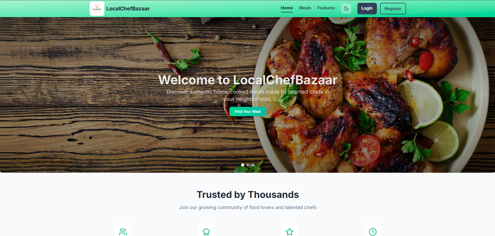

# LocalChefBazaar – Role-Based Food Marketplace

## 📸 Screenshots

### 🏠 Home Page

## 🔗 Live Website
https://local-chef-bazaar01.netlify.app/

## 📌 Project Overview
LocalChefBazaar is a  food marketplace platform that connects local chefs with customers. The system is built with role-based user experiences where chefs can create and manage meals, users can browse and order food, and admins oversee and control platform operations. Secure authentication and CRUD functionality ensure reliable data handling and user management.

## 👥 User Roles & Features

### 👨‍🍳 Chef
- Create, update, and delete meals
- Manage listed food items
- View customer orders

### 👤 User
- Browse available meals
- Place food orders
- View order history
- Adds favourite meal

### 🛡️ Admin
- Manage users and chefs
- Control platform data
- Monitor meals and orders

## 🚀 Core Features
- Role-based authentication and authorization
- Secure JWT-based login system
- Full CRUD operations
- Meal creation and order management
- Protected routes for different user roles
- Responsive and intuitive UI

## 🛠️ Technologies Used

### Frontend
- React
- JavaScript
- Tailwind CSS

### Backend
- Node.js
- Express.js

### Database
- MongoDB

### Authentication & Security
- JWT (JSON Web Tokens)
- Protected API routes

## 📦 Major Dependencies
- express
- mongodb
- jsonwebtoken
- cors
- dotenv

## How to Run Locally
1. Clone the repository  
2. Run `npm install`  
3. Create a `.env` file with required variables (MongoDB URI, JWT secret)  
4. Start the server using `npm start`  
5. Run the client using `npm run dev`  
6. Open `http://localhost:5173` in your browser  

> Ensure the backend is running before starting the frontend.